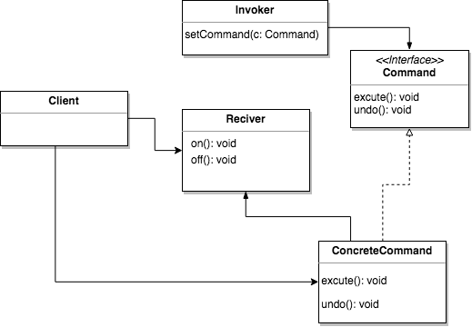

# CommandPattern

- Command 패턴(Command Pattern)은 요청 내역을 객체로 캡슐화하여 클라이언트를 서로 다른 요청내역에 따라 매개변수화 할수 있습니다.
- 요청을 큐에 저장하거나 로그로 기록 할 수 있고 작업취소 기능을 지원할 수 있습니다.
- 요청하는 객체와 그 요청을 수행하는 객체를 분리시키고 싶을때 사용합니다.

# CommandPattern UML

