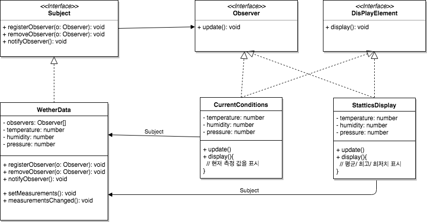

# ObserverPattern

- 옵저버 패턴(Observer Pattern)에서는 한 객체의 상태가 바뀌면 그개게에 의존하는 다른객체들한테 연락이 가고 자동으로 내용이 내용이 갱신되는 방식으로 일대다 의존성을 정의합니다.
- 옵저버 패턴을 구현하는 방법에는 여러 가지가 있지만 주제(Subject) 인터페이스와 옵저버(Observer) 인터페이스가 들어있는 클래스 디자인을 바탕으로 합니다.

## Wether Station UML

